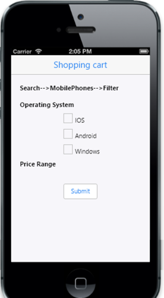
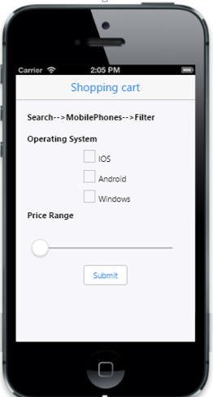

# Getting Started

Essential JavaScript Mobile Slider provides the selection of a single value or a range of values, using an interface with sliding handles.  The following example shows you how to create a Shopping Cart App and through that learn the features in the Slider widget.

{  | markdownify }
{:.image }

## Create the layout for Shopping Cart App

Essential JS Mobile Slider widget is rendered by a &lt;div&gt; element with its required properties. You can customize Slider control by changing its properties according to your requirements. In the Shopping Cart App, the Range Slider is used to set the price range.

Create an HTML file and add the following template to the HTML file.



<!DOCTYPE html>

<html>

<head>

<title>Slider</title>

<link href="[http://cdn.syncfusion.com/13.1.0.21/js/mobile/ej.mobile.all.min.css](http://cdn.syncfusion.com/13.1.0.21/js/mobile/ej.mobile.all.min.css)" rel="stylesheet" />

                

  

</head>

<body>

        

        <!-- header control -->

        

        

        

        

        

        

        

        <h1>Search-->MobilePhones-->Filter</h1>

        <h1>Operating System</h1>

        

        <!-- create check box for different OS  -->

        

        <table border="0" cellpadding="6">

          <tr>

             <td>

              <input id="ios" name="chkbox" data-role="ejmcheckbox" data-ej-text="IOS" /></td>

              <td>                           

            </tr>

             <tr>

             <td>

             <input id="android" name="chkbox" data-role="ejmcheckbox" data-ej-text="Android"/></td>

              </tr>

               <tr>

                <td>

               <input id="windows" name="chkbox" data-role="ejmcheckbox" data-ej-text="Windows" /></td>

                 <td>

                  </tr>    

    </table>

        

        

        <h1>Price Range</h1>

        

        

        

        

        <!—Add Slider control here -->        

        

        

        <input type="button" data-role="ejmbutton" data-ej-text="Submit" id="button" data-ej-touchend="ShowDialog" />

        

        <!-- dialog control -->

        

        
Based on your suggestion the phones will displayed now     

        

        

        
 

        <!-- ScrollPanel -->

 

        

</body>

</html>



Execute the above code example to render the following output.

{  | markdownify }
{:.image }

## Create Slider control

To render Slider control, set ejmslider to data-role attribute to &lt;div&gt; element. Set 100 as the minimum value for the Slider using data-ej-minvalue, and set 5000 as the maximum value using data-ej-maxvalue. Set data-ej-incrementstep to 100 so that the slider is moved for every 100 values. 

Refer to the following code example.



<!-- Slider control -->

        



Run the above code example to render the following output.

{  | markdownify }
{:.image }

## Create the Range Slider

You can set the price range using Range Slider. Set data-ej-enablerange attribute to “True”. You can set the initial range values by using data-ej-values attribute. Here, you can set the values as [300, 1500]. The Slider’s left thumb is set to 300 and the right thumb is set to 1500.

Add the following code to the Slider &lt;div&gt;.





Execute the above code example to render the following output.

{  | markdownify }
{:.image }

## Handle events

In this scenario, when you change the Slider value, the corresponding values are updated to the &lt;span&gt; element that acts as a label for Slider. You can use data-ej-slide event that is handled by appropriate function. Add the following code to the Slider &lt;div&gt;.





From the Slider’s getValue API, you can get the present value of both the Slider handles, anytime. Add the following code example to the &lt;script&gt; tag. 



//to display the slider value in span element (label) at initialize

        $(function (args) {

            window.dialogObject = $("#alertdlg").data("ejmDialog"); //to create dialog object

            window.sliderObject = $("#slider").data("ejmSlider"); //to create slider object

            setValue("300,1500");//set slider labels at initialize 

          });

        // handling slider slide event

        function processOnSlide() {

            var value = sliderObject.getValue();// get the value of slider by using getValue API

            setValue(value);

        }

        function setValue(value) {

            var position = value.indexOf(",");

            var min = value.substring(0, position); //to get left thumb value

            var max = value.substring(position + 1); //to get right thumb value

            $("#minvalue").html("$" + min); //to set left thumb value to the left span

            $("#maxvalue").html("$" + max); // to set right thumb value to the right span

        }



Execute the above code to render the following output.

{  | markdownify }
{:.image }

In this scenario, a dialog is displayed to provide information about the search when Submit is clicked. Add the following code to the &lt;script&gt; tag.



//to open dialog

        function ShowDialog(args) {

            dialogObject.open(); //to show dialog

        } 

        //to close dialog

        function alertClose(args) {

            dialogObject.close(); //close dialog

        }



Execute the above code example to render the following output, when you click Submit.

{  | markdownify }
{:.image }

