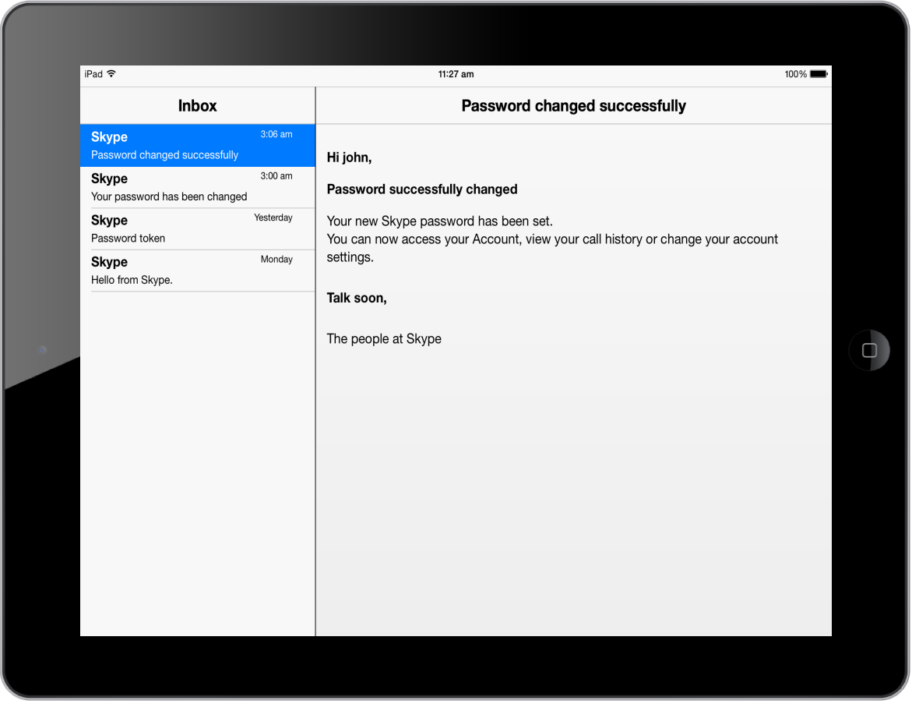
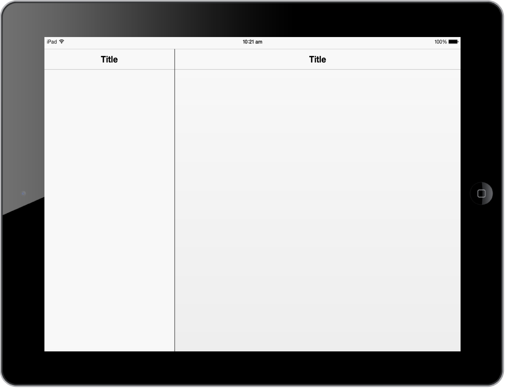
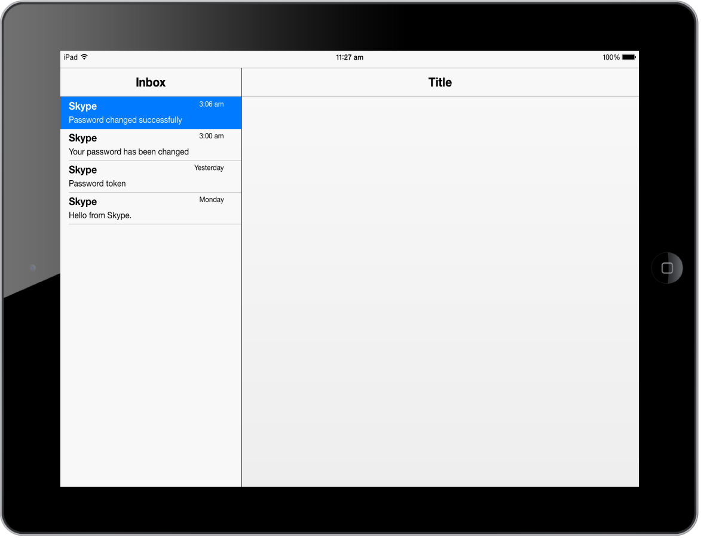

# Getting Started

## Create your first SplitPane in JavaScript

This section enables you to create SplitPane using JavaScript in your mobile app.

The Essential JavaScript Mobile SplitPane divides up a region on the web page.  It can be configured to split up the horizontal view vertically. Right side panes can display the content from an external URL that is specific to the item selected in the left pane. In the following guidelines, you can learn about the features in mobile SplitPane widget by creating a Mail App.

## Create the required layout

The Essential JavaScript Mobile Splitpane widget is rendered based on the default values for all the properties. You can easily customize the Splitpane control by changing their properties according to your need. The following steps guide you to create a Mail App.

Create an HTML file and paste the following template to it for Mail App creation.



<!DOCTYPE html>

<html>

	<head>

		<title>Splitpane</title>

		<link href="[http://cdn.syncfusion.com/13.1.0.21/js/mobile/ej.mobile.all.min.css](http://cdn.syncfusion.com/13.1.0.21/js/mobile/ej.mobile.all.min.css)" rel="stylesheet" />

		

		

		

		

	</head>

	<body>

		

			

				

					<!--Add Splitpane Element here-->

				

			

		

	</body>

</html>



## Create the SplitPane control

To render the SplitPane control, you need to set data-role attribute to ejmsplitpane to a div element. 

Refer the following code example.



                                            

    

        
                  

				<!--Left pane content-->

        

    

	

		

			<!--Right pane content-->				

		

	



Run this code and you can see the following output.

## Add left Pane content

To set left pane header title “data-ej-leftheadersettings-title” attribute with the desired title, set it as Inbox. In android mode there is no header for splitpane. Instead, you have toolbar control. To set the toolbar title, add “data-ej-toolbarsettings-android-title” attribute with the desired title for android mode. Use ListView control with template support to display the left pane content (Inbox items).

Refer to the following code example.



	

		

			

				

					{{>Name}} {{>Time}}

					

						{{>About}}

					

				

			

		

	

	

		

		

	

 





// data source for listbox with right pane’s url for each item

window.dbitem =

[{ "Name": "Skype", "Time": "3:06 am", "About": "Password changed successfully", "Url": "load1.html" },

	{ "Name": "Skype", "Time": "3:00 am", "About": "Your password has been changed", "Url": "load2.html" },

	{ "Name": "Skype", "Time": "Yesterday", "About": "Password token", "Url": "load3.html" },

	{ "Name": "Skype", "Time": "Monday", "About": "Hello from Skype", "Url": "load4.html" }];



Use the following styles to add ListView element.



.cont-bg {
    padding: 6px 0px;
}

.templatetext {
    font-weight: bolder;
    font-size: 17px;
}

#templatelist .timestyle {
    float: right;
    font-size: 12px;
    position: relative;
    padding-right: 2px;
}

#templatelist .aboutstyle {
    font-size: 14px;
}

/* listbox active item color */

.e-m-ios7.e-m-tablet .e-m-state-active .e-m-list-div * {
    color: #FFFFFF;
}

#splitview.e-m-windows.e-m-dark .e-m-sp-left {
    background: black;
}



Run this code and you can see the following output.

## Add right Pane content

When you click the left pane list item, you can view the content that is specific to the selected item in right pane. Right side panes can display content from an external URL using the loadContent API. You need to pass external URL, right pane title and transition parameters as arguments for loadContent API. The left pane list item selection is handled by listItemSelect function.

Refer to the following code example.



// data source for listbox with right pane’s url for each item

window.dbitem =

[{ "Name": "Skype", "Time": "3:06 am", "About": "Password changed successfully", "Url": "load1.html" },

	{ "Name": "Skype", "Time": "3:00 am", "About": "Your password has been changed", "Url": "load2.html" },

	{ "Name": "Skype", "Time": "Yesterday", "About": "Password token", "Url": "load3.html" },

	{ "Name": "Skype", "Time": "Monday", "About": "Hello from Skype", "Url": "load4.html" }];

// initial loading right pane content

$(document).ready(function () {

	// $("#splitview").data("ejmSplitPane").loadContent(toPage, options)

	var split = $("#splitview").data("ejmSplitPane");

	split.loadContent(dbitem[0].Url, {

		rightHeaderSettings:

		{ title: dbitem[0].About },

		toolbarSettings: { android: { title: dbitem[0].About } }, 

		transition: "none"

	});

});

// loading right pane content by clicking list item selected

function listItemSelect(args) {

	// $("#splitview").data("ejmSplitPane").loadContent(toPage, options)

	var split = $("#splitview").data("ejmSplitPane");

	split.loadContent(dbitem[args.index].Url, {

		rightHeaderSettings:

		{ title: dbitem[args.index].About }, 

		toolbarSettings: { android: { title: dbitem[args.index].About } }, 

		transition: "none"

	});

}



Create an HTML file with load1.html name and add the following code to the file.



<h2>

    Hi John,</h2>

 

<h3>

    Password successfully changed</h3>

 

Your new Skype password has been set.

 

You can now access your Account, view your call history or change your account settings.

 

 

<h5>

    Talk soon,</h5>

The people at Skype



Create an HTML file with load2.html name and add the following code to the file.



<h2>

    Hello John,</h2>

 

<h3>

    Your password has been changed</h3>

 

Your Skype password has been changed. If you did not change this yourself please

contact one of the administrators of the Skype Manager you belong to.

 

 

<h5>

    Talk soon,
	
</h5>

The people at Skype



Create an HTML file with load3.html name and add the following code to the file



<h2>

    Hello John,

</h2>

 

<h3>

    Password token</h3>

 

Reset your password with this temporary code. Please note that this link is only

active for 6 hours after receipt. After the time limit expires, the code does not

work and you have to resubmit the password change request. 

 

If the link doesn't work, you can enter the code manually using this token: 45c5chg15ae33c438ch2cc7ehn004hg6

 

 

<h5>

    Talk soon,

</h5>

The people at Skype



Create an HTML file with load4.html name and add the following code to the file.



 <h3>

    Hi John,
	
</h3>

 

<h2>

    Welcome to Skype</h2>

 

Congratulations on joining Skype! Now you can enjoy the magic of free face-to-face

calls, instant messaging, screen sharing and so much more - all with Skype.

 

 

<h5>

    Talk soon,

</h5>

The people at Skype



Run this code and you can see the following output.

