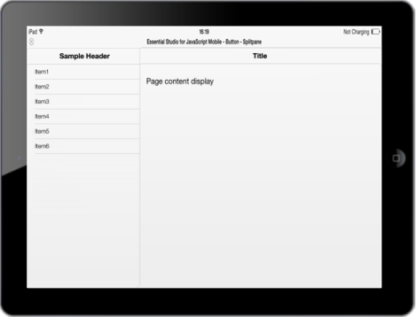
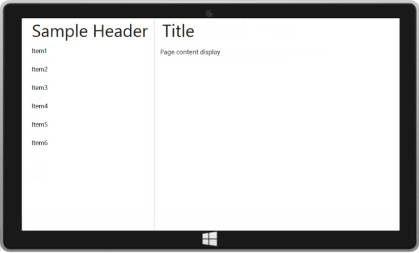
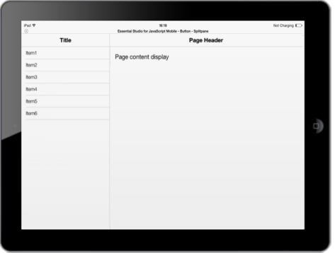
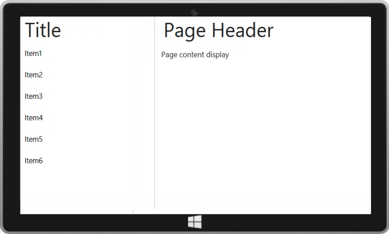

## iOS7 and Windows Specific Customization

You can set the android and windows specific properties to the control by using the following settings.

### LeftHeader settings

You can show/hide the leftpane header by setting the “data-ej-showleftpaneheader” attribute as true/false. Default value is true.

You can customize the left pane header by using “data-ej-leftheadersettings” attribute. The following code illustrates how to set the title for the left pane.  



        

            <!--Left pane content-->

            

                <ul>

                    <li data-ej-text="Item1"></li>

                    <li data-ej-text="Item2"></li>

                    <li data-ej-text="Item3"></li>

                    <li data-ej-text="Item4"></li>

                    <li data-ej-text="Item5"></li>

                    <li data-ej-text="Item6"></li>         

                </ul>

            

        

     



### Script Section

While selecting an item from the left pane, the corresponding content in right pane is to be loaded. To achieve this, you can handle the touchEnd handler using the loadContent method as follows.



    function loadContent() {

        $("#splitpane").ejmSplitPane("loadContent", "page.html");

}



### Page Content Section

Add the following code in “page.html” HTML file for right pane.



Page content display



The following screenshot illustrates the output for iOS7 and Windows.

iOS7

{  | markdownify }
{:.image }

Windows

{  | markdownify }
{:.image }

Likewise, you can customize all other properties of header. For more reference, check the complete documentation of header. 

### RightHeader settings

You can show/hide the right pane header by set as false/true to the “data-ej-showrightpaneheader” attribute. By default the right pane header is displayed, as the “data-ej-showRightPaneHeader” attribute is set to true.

You can customize the header related features by using “data-ej-rightheadersettings” attribute. The following code illustrates how to set the title for the right pane.  



        

            <!--Left pane content-->

            

                <ul>

                    <li data-ej-text="Item1"></li>

                    <li data-ej-text="Item2"></li>

                    <li data-ej-text="Item3"></li>

                    <li data-ej-text="Item4"></li>

                    <li data-ej-text="Item5"></li>

                    <li data-ej-text="Item6"></li>

                </ul>

            

        

    



Refer to the script section and page content section to load the right pane content of appropriate page created. The following screenshot illustrates the output for iOS7 and Windows.

iOS7

{  | markdownify }
{:.image }

Windows

{  | markdownify }
{:.image }

Likewise, you can customize all other properties of header. For more reference, check the complete documentation of header.

