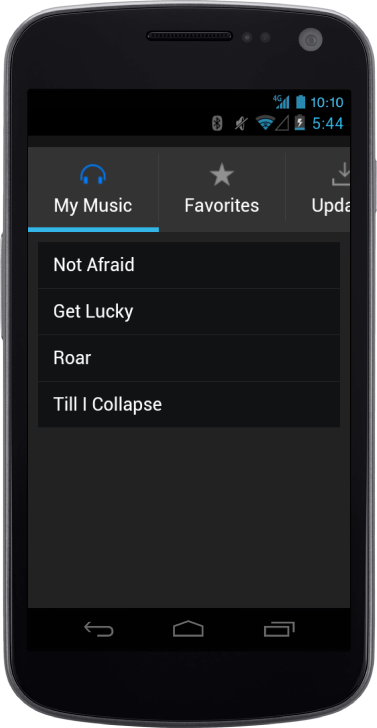

## Android specific customization

You can set the Android specific properties to the control by accessing the Android property.

### ShowImage

The “data-ej-android-showimage” attribute is used to enable or disable the image to your Tab. Default value is set to false.



    <ul>

        <li data-ej-href="#mymusic" data-ej-text='My Music' data-ej-android-imageclass="icn-Mymusic"></li>

        <li data-ej-href="#favorites" data-ej-text='Favorites' data-ej-android-imageclass="icn-Favorites"></li> 

        <li data-ej-href="#updates" data-ej-text='Updates' data-ej-android-imageclass="icn-Updates"></li>         

    </ul>

<!-- Tab first item -->

    <ul>

        <li data-ej-text="Not Afraid"></li>

        <li data-ej-text="Get Lucky"></li>

        <li data-ej-text="Roar"></li>

        <li data-ej-text="Till I Collapse"></li>

    </ul>

<!-- Tab second item -->

    <ul>

        <li data-ej-text="Dark Horse"></li>

        <li data-ej-text="Roar"></li>

    </ul>

<!-- Tab third item -->

 <ul>

     <li data-ej-text="New songs available for download"></li>

     <li data-ej-text="1.2.1 update available"></li>

 </ul>



The following screenshot displays the Android showImage:

{  | markdownify }
{:.image }

### ImageClass

The “data-ej-android-imageclass” attribute is used to add images to the Tab by specifying the imageClass for individual items in the Tab.



    <ul>

        <li data-ej-href="#mymusic" data-ej-text='My Music' data-ej-android-imageclass="icn-Mymusic"></li>

        <li data-ej-href="#favorites" data-ej-text='Favorites' data-ej-android-imageclass="icn-Favorites"></li> 

        <li data-ej-href="#updates" data-ej-text='Updates' data-ej-android-imageclass="icn-Updates"></li>         

    </ul>

<!-- Tab first item -->

    <ul>

        <li data-ej-text="Not Afraid"></li>

        <li data-ej-text="Get Lucky"></li>

        <li data-ej-text="Roar"></li>

        <li data-ej-text="Till I Collapse"></li>

    </ul>

<!-- Tab second item -->

    <ul>

        <li data-ej-text="Dark Horse"></li>

        <li data-ej-text="Roar"></li>

    </ul>

<!-- Tab third item -->

 <ul>

     <li data-ej-text="New songs available for download"></li>

     <li data-ej-text="1.2.1 update available"></li>

 </ul>



The following screenshot displays the Android imageClass:

{  | markdownify }
{:.image }

### Position

The “data-ej-android-position” attribute holds fixed and normal values. Normal position allows relative position of the element to the appview and fixed position allows fixed position of the element. Default position is set to fixed.



    <ul>

        <li data-ej-href="#mymusic" data-ej-text='My Music' data-ej-android-imageclass="icn-Mymusic"></li>

        <li data-ej-href="#favorites" data-ej-text='Favorites' data-ej-android-imageclass="icn-Favorites"></li> 

        <li data-ej-href="#updates" data-ej-text='Updates' data-ej-android-imageclass="icn-Updates"></li>         

    </ul>

<!-- Tab first item -->

    <ul>

        <li data-ej-text="Not Afraid"></li>

        <li data-ej-text="Get Lucky"></li>

        <li data-ej-text="Roar"></li>

        <li data-ej-text="Till I Collapse"></li>

    </ul>

<!-- Tab second item -->

    <ul>

        <li data-ej-text="Dark Horse"></li>

        <li data-ej-text="Roar"></li>

    </ul>

<!-- Tab third item -->

 <ul>

     <li data-ej-text="New songs available for download"></li>

     <li data-ej-text="1.2.1 update available"></li>

 </ul>



The following screenshot displays the AndroidPosition:

{  | markdownify }
{:.image }

