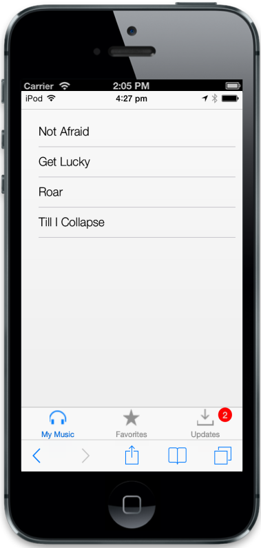
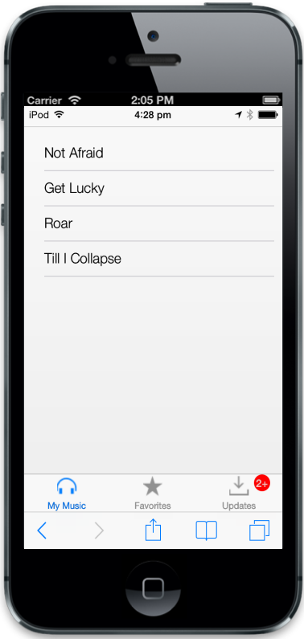

# Customize Badge

To know the number of updates available in the specific Tab item before viewing it, it is notified through the Badge support. 

## Enabled

The “data-ej-enabled” attribute is used to enable or disable the badge in the Tab. Default value is set to false.

## Value

The “data-ej-value” attribute is used to set the badge value to a Tab item. Default value is set to 0. You can refer the following code example.



        <ul>

            <li data-ej-href="#mymusic" data-ej-text='My Music' data-ej-ios7-imageclass="icn-Mymusic"></li>

            <li data-ej-href="#favorites" data-ej-text='Favorites' data-ej-ios7-imageclass="icn-Favorites"></li>

            <li data-ej-href="#updates" data-ej-text='Updates' data-ej-ios7-imageclass="icn-Updates" data-ej-badge-enabled="true" data-ej-badge-value="2"></li>

        </ul>

    

<!-- Tab first item -->

    <ul>

        <li data-ej-text="Not Afraid"></li>

        <li data-ej-text="Get Lucky"></li>

        <li data-ej-text="Roar"></li>

        <li data-ej-text="Till I Collapse"></li>

    </ul>

<!-- Tab second item -->

    <ul>

        <li data-ej-text="Dark Horse"></li>

        <li data-ej-text="Roar"></li>

    </ul>

<!-- Tab third item -->

 <ul>

     <li data-ej-text="New songs available for download"></li>

     <li data-ej-text="1.2.1 update available"></li>

 </ul>



The following screenshot displays the Customization of badge:

## MaxValue

The “data-ej-maxvalue” attribute is used to set the maximum badge value to a Tab item. Default value is set to 100. 



        <ul>

            <li data-ej-href="#mymusic" data-ej-text='My Music' data-ej-ios7-imageclass="icn-Mymusic"></li>

            <li data-ej-href="#favorites" data-ej-text='Favorites' data-ej-ios7-imageclass="icn-Favorites"></li>

            <li data-ej-href="#updates" data-ej-text='Updates' data-ej-ios7-imageclass="icn-Updates" data-ej-badge-enabled="true" data-ej-badge-value="3" data-ej-badge-maxvalue="2"></li>

        </ul>

<!-- Tab first item -->

    <ul>

        <li data-ej-text="Not Afraid"></li>

        <li data-ej-text="Get Lucky"></li>

        <li data-ej-text="Roar"></li>

        <li data-ej-text="Till I Collapse"></li>

    </ul>

<!-- Tab second item -->

    <ul>

        <li data-ej-text="Dark Horse"></li>

        <li data-ej-text="Roar"></li>

    </ul>

<!-- Tab third item -->

 <ul>

     <li data-ej-text="New songs available for download"></li>

     <li data-ej-text="1.2.1 update available"></li>

     <li data-ej-text="1.2.2 update available"></li>

 </ul>



The following screenshot displays the maxValue

