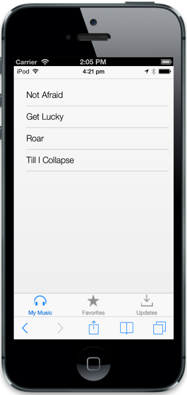
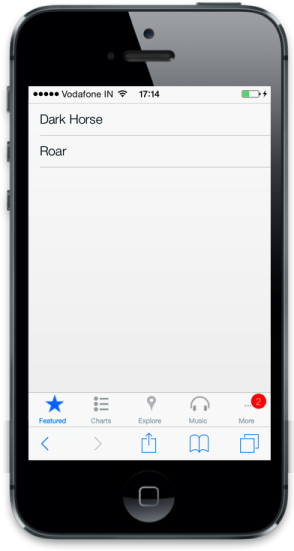
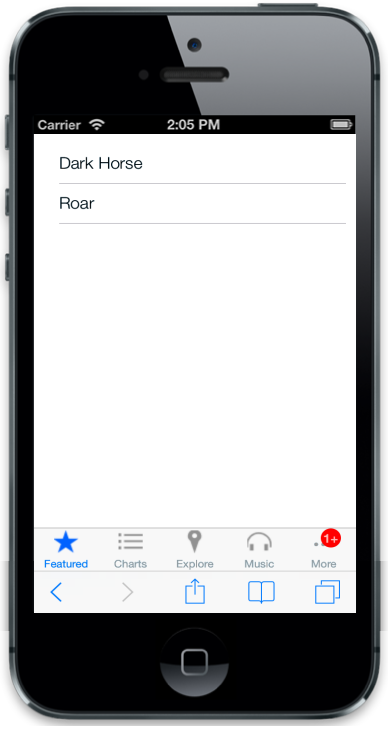

# IOS7 specific customization

You can set IOS7 specific properties to the control by accessing IOS7 property.

## ImageClass

The “data-ej-ios7-imageclass” attribute is used to add images to the Tab by specifying the data-ej-ios7-imageclass for individual items in the Tab.



    <ul>

        <li data-ej-href="#mymusic" data-ej-text='My Music' data-ej-ios7-imageclass="icn-Mymusic"></li>

        <li  data-ej-href="#favorites" data-ej-text='Favorites' data-ej-ios7-imageclass="icn-Favorites"></li> 

        <li data-ej-href="#updates" data-ej-text='Updates' data-ej-ios7-imageclass="icn-Updates"></li>  

    </ul>

<!-- Tab first item -->

    <ul>

        <li data-ej-text="Not Afraid"></li>

        <li data-ej-text="Get Lucky"></li>

        <li data-ej-text="Roar"></li>

        <li data-ej-text="Till I Collapse"></li>

    </ul>

<!-- Tab second item -->

    <ul>

        <li data-ej-text="Dark Horse"></li>

        <li data-ej-text="Roar"></li>

    </ul>

<!-- Tab third item -->

 <ul>

     <li data-ej-text="New songs available for download"></li>

     <li data-ej-text="1.2.1 update available"></li>

 </ul>



To add the images, use the following styles.



    .icn-Mymusic {

        background: url('http://js.syncfusion.com/UG/Mobile/Content/mymusic.png') no-repeat center center;

    }

    .icn-Updates {

        background: url('http://js.syncfusion.com/UG/Mobile/Content/updates.png') no-repeat center center;

    }

    .e-m-tabitem.e-m-state-default .icn-Mymusic {

        background: url('http://js.syncfusion.com/UG/Mobile/Content/mymusic-default.png') no-repeat center center;

    }

    .e-m-tabitem.e-m-state-default .icn-Updates {

        background: url('http://js.syncfusion.com/UG/Mobile/Content/updates-default.png') no-repeat center center;

    }

    .icn-Favorites {

        background: url('http://js.syncfusion.com/UG/Mobile/Content/favorites.png') no-repeat center center;

    }

    .e-m-tabitem.e-m-state-default .icn-Favorites {

        background: url('http://js.syncfusion.com/UG/Mobile/Content/favorites-default.png') no-repeat center center;

    }

    .e-m-tab.e-m-ios7 .e-m-tab-image {

        width: 26px;

    }

    .e-m-tab-content .e-m-content {

       padding: 0px;

    }

   .e-m-lv .e-m-list .e-m-list-text,.e-m-windows.e-m-lv.e-m-mobile .e-m-list-text {

       left:0px;

    }

   .e-m-lv.e-m-android .e-m-list .e-m-list-text {

       left: 20px;

    }



The following screenshot displays imageClass:

## OverflowBadge

In the iOS, when the number of Tab items do not fit the available screen width, it adds a “more” Tab that contains the list of overflowed Tab items as its content. overflowBadge specifies badge representation for overflowed Tab items (number of updates available in all overflowed Tab items). Set the badge specific properties by means of accessing this property for overflowing Tab items.

### Enabled

The “data-ej-ios7-overflowbadge-enabled” attribute is used to enable or disable the badge to your overflow Tab item. Default value is set to false.

### Value

The “data-ej-ios7-overflowbadge-value” attribute is used to set the badge value for the overflow Tab item. Default value is set to 0.



        <ul>

            <li data-ej-href="#favorites" data-ej-text='Featured' data-ej-ios7-imageclass="icn-Favorites"></li>

            <li data-ej-href="#charts" data-ej-text='Charts' data-ej-ios7-imageclass="icn-Charts"></li>

            <li data-ej-href="#explore" data-ej-text='Explore' data-ej-ios7-imageclass="icn-Explore"></li>

            <li data-ej-href="#music" data-ej-text='Music' data-ej-ios7-imageclass="icn-Mymusic"></li>

            <li data-ej-href="#updates" data-ej-text='Updates' data-ej-ios7-imageclass="icn-Updates"></li>

            <li data-ej-href="#search" data-ej-text='Search' data-ej-ios7-imageclass="icn-Search"></li>

        </ul>

    

        <!-- Tab first item -->

        

            <ul>

                <li data-ej-text="Dark Horse"></li>

                <li data-ej-text="Roar"></li>

            </ul>

        
        

        <!-- Tab second item -->

        

            <ul>

                <li data-ej-text="Facebook"></li>

                <li data-ej-text="Skype"></li>

                <li data-ej-text="YouTube"></li>

            </ul>

        
 

        <!-- Tab third item -->

        

            <ul>

                <li data-ej-text="Find your near Location"></li>                

            </ul>

        
  

        <!-- Tab fourth item -->

        

            <ul>

                <li data-ej-text="Not Afraid"></li>

                <li data-ej-text="Get Lucky"></li>

                <li data-ej-text="Roar"></li>

                <li data-ej-text="Till I Collapse"></li>

            </ul>

        
  

        <!-- Tab fifth item -->            

        

            <ul>

                <li data-ej-text="New songs available for download"></li>

                <li data-ej-text="1.2.1 update available"></li>

            </ul>

        
 

        <!-- Tab sixth item -->  

        

            <ul>

                <li data-ej-text="Search content here"></li>                

            </ul>

        



The following screenshot displays the Overflow Badge:

 '

### MaxValue

The “data-ej-ios7-overflowbadge-maxvalue” attribute is used to set the maximum badge value to the overflow Tab item. Default value is set to 100.



        <ul>

            <li data-ej-href="#favorites" data-ej-text='Featured' data-ej-ios7-imageclass="icn-Favorites"></li>

            <li data-ej-href="#charts" data-ej-text='Charts' data-ej-ios7-imageclass="icn-Charts"></li>

            <li data-ej-href="#explore" data-ej-text='Explore' data-ej-ios7-imageclass="icn-Explore"></li>

            <li data-ej-href="#music" data-ej-text='Music' data-ej-ios7-imageclass="icn-Mymusic"></li>

            <li data-ej-href="#updates" data-ej-text='Updates' data-ej-ios7-imageclass="icn-Updates"></li>

            <li data-ej-href="#search" data-ej-text='Search' data-ej-ios7-imageclass="icn-Search"></li>

        </ul>

    

        <!-- Tab first item -->

        

            <ul>

                <li data-ej-text="Dark Horse"></li>

                <li data-ej-text="Roar"></li>

            </ul>

        
        

        <!-- Tab second item -->

        

            <ul>

                <li data-ej-text="Facebook"></li>

                <li data-ej-text="Skype"></li>

                <li data-ej-text="YouTube"></li>

            </ul>

        
 

        <!-- Tab third item -->

        

            <ul>

                <li data-ej-text="Find your near Location"></li>                

            </ul>

        
  

        <!-- Tab fourth item -->

        

            <ul>

                <li data-ej-text="Not Afraid"></li>

                <li data-ej-text="Get Lucky"></li>

                <li data-ej-text="Roar"></li>

                <li data-ej-text="Till I Collapse"></li>

            </ul>

        
  

        <!-- Tab fifth item -->            

        

            <ul>

                <li data-ej-text="New songs available for download"></li>

                <li data-ej-text="1.2.1 update available"></li>

            </ul>

        
 

        <!-- Tab sixth item -->  

        

            <ul>

                <li data-ej-text="Search content here"></li>                

            </ul>

        



The following screenshot displays the maxValue:

