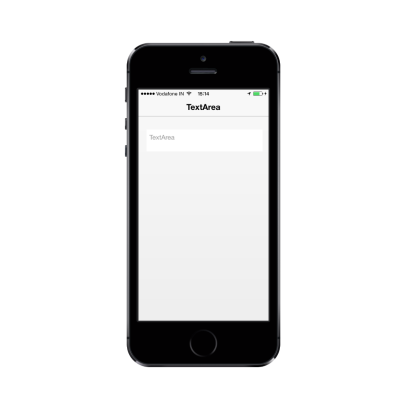

## Border Support

ShowBorder property decides whether the TextArea border can be visible or hidden. The default value is true.

Refer to the following code example.



<textarea id="textarea" data-role="ejmtextarea" data-ej-watermarktext="TextArea" data-ej-showborder="false"></textarea>



{{ '' | markdownify }}
{:.image }

