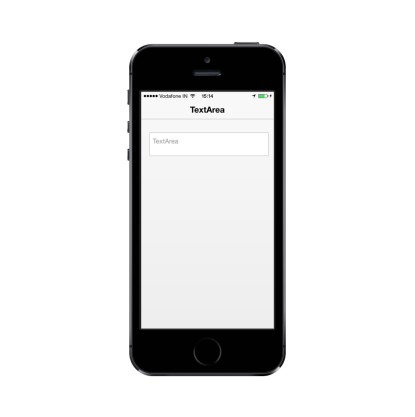

# Customize Watermark text

The watermark text specifies a short hint that describes the expected value of the input field. This can be achieved by using the “data-ej-watermarktext” attribute.



<textarea id="textarea" data-role="ejmtextarea" data-ej-watermarktext="TextArea" ></textarea>



