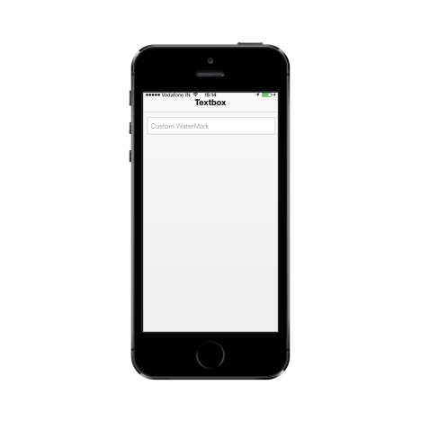

# Customize Watermark text

Watermark text property is used in customize the text that appears in the background of the textbox. It acts like a label for the textbox.

Refer to the following code example.



<input id="textbox_sample" data-role="ejmtextbox" data-ej-watermarktext="Custom WaterMark">    



The following screenshot displays the customization of the text with Watermarktext Property.

