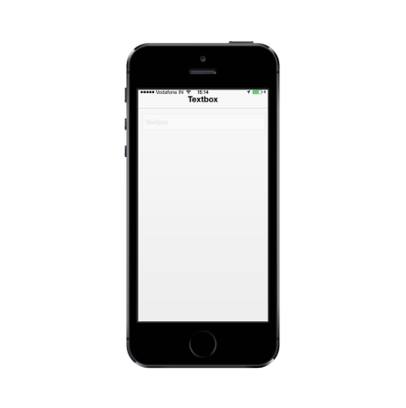

# Enable and Disable

The Enabled property is used to enable or disable the Textbox control. The default value is true.

Refer to the following code example.



<input id="textbox_sample" data-role="ejmtextbox" data-ej-watermarktext="Textbox" data-ej-enabled="false">



The following screenshot displays the Enabled property set to false.

