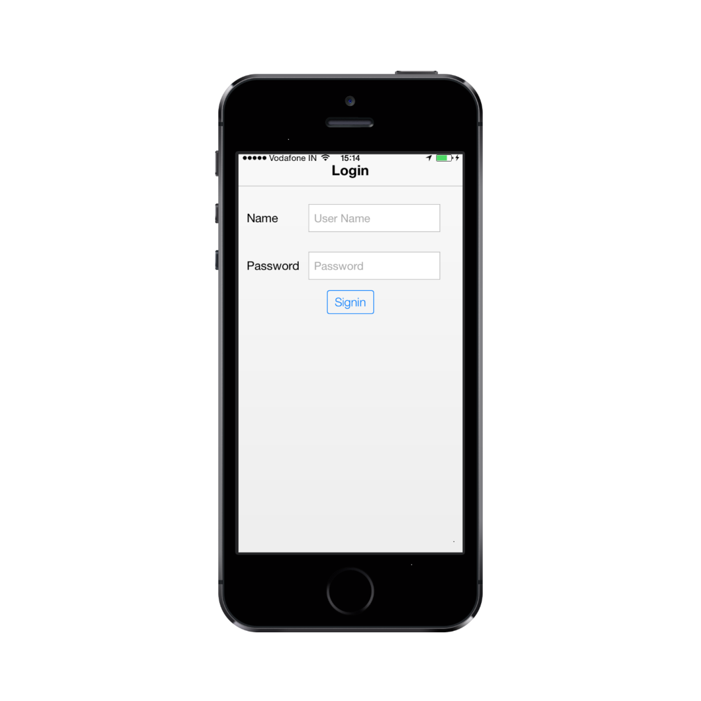
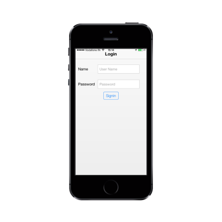

# Getting Started

To create a textbox for the login page in the mobile application, follow the guidelines given. 

## Create the layout

Create a HTML file and add the following template to the HTML file.



<!DOCTYPE html>

<html>

	<head>

		<meta id="viewport" name="viewport" content="width=device-width, initial-scale=1.0,maximum-scale=1.0, user-scalable=no" />

		<title>Textbox</title>

		<link href="[http://cdn.syncfusion.com/13.1.0.21/js/mobile/ej.mobile.all.min.css](http://cdn.syncfusion.com/13.1.0.21/js/mobile/ej.mobile.all.min.css)" rel="stylesheet" />

		

		

		

		

		

	</head>

	<body>

		 <!--Header Control-->

		

		

			

				

					<table class="editors">

						<tbody>

							<tr>

								<td>

									<label>

										Name

									</label>

								</td>

								<td>

									<!--Add Textbox control-->                                

								</td>

							</tr>

							<tr>

								<td>

									<label>

										Password

									</label>

								</td>

								<td>

									<!--Password Control-->

									<input id="password" data-role="ejmpassword" data-ej-watermarktext="Password" />

								</td>

							</tr>

						</tbody>

					</table>

					

						

							<!--Button Control-->

							<input type="button" data-role="ejmbutton" data-ej-text="Login" />

						

					

				

			

		

	</body>

</html>



## Add Textbox Control

To create the Textbox control add the following code.



<input id="textbox_sample" data-role="ejmtextbox" data-ej-watermarktext="User Name" />



Run the code and get the following output.

