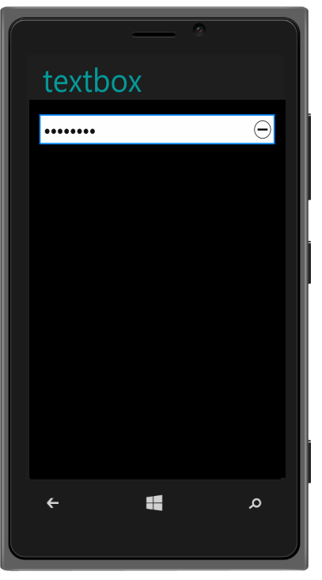

# Windows specific customization

The data-ej-allowreset attribute is used to reset the password value in windows rendermode. The default value is true.

Refer to the following code example.



<input id="textbox_sample" data-role="ejmpassword" data-ej-watermarktext="Password" data-ej-rendermode="windows" data-ej-windows-allowreset="true">



Textbox - AllowReset
{:.caption}