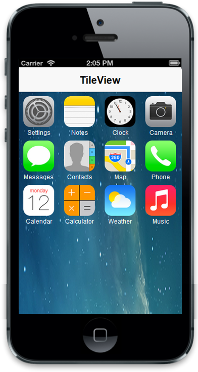
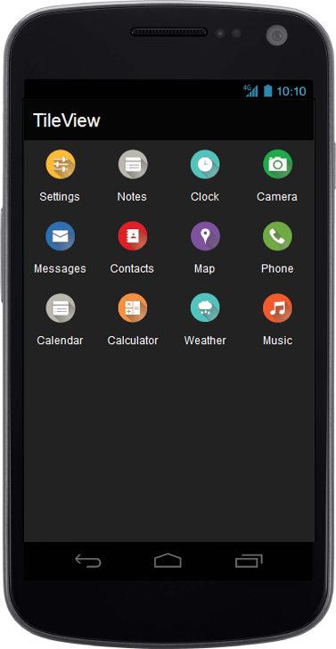
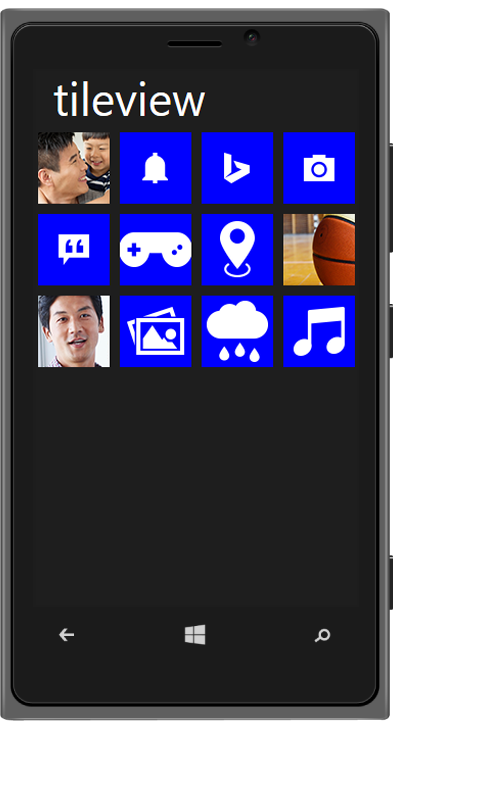
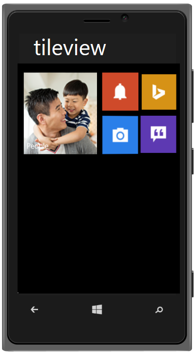

## Add Group Tiles

You can use the following pre-defined classes to change a Tile as Grouped Tile. By using this, you can achieve the alignment of the Group Tiles automatically instead of writing your own css classes.

<table>
<tr>
<td>
Class Name</td><td>
Explanation</td></tr>
<tr>
<td>
group</td><td>
To group the column elements</td></tr>
<tr>
<td>
column</td><td>
To align the Tile in column manner</td></tr>
<tr>
<td>
small-col-2</td><td>
To align the small size Tiles in windows mode</td></tr>
</table>
Default usage:



    

           <!— Add tile control here -->

    



To render the column grouped Tile, render the number of Tiles inside a div element with the class ‘column’. Then append that column group element to a div with the class ‘group’.                                                            

Refer to the following code example.



  

            

                

                

                

                

                

                

                

                

                

                

                

                

                

                

                

                

            

            

                

                

                

                

                

                

                

                

            

        

    



Refer to the following code example for the CSS classes.



        .e-m-ios7 .defaultsample {

            background: url("../themes/sample/tileview/ios7/bg.png") no-repeat scroll 0 0 / 100% 100% rgba(0, 0, 0, 0);

            height: 690px;

            width: 100%;

            position: absolute;

        }

        .e-m-ios7 .e-m-tile.e-m-tile-wrapper-small .e-m-tile-image {

            background-size: 60px 60px;

        }

        .e-m-ios7 .e-m-tile

        {

            margin-left:-3px;

        }

        .e-m-windows .group

        {

            padding:0 2%;

        }



Refer to the following code example for the script section.



        if (ej.getRenderMode() == "windows")

            $($('.group').find('div[data-role="ejmtile"]')).attr({ 'data-ej-backgroundcolor': 'blue' });

        if (ej.getRenderMode() == "android")

            $($('.group').find('div[data-role="ejmtile"]')).attr({ 'data-ej-theme': 'light' });



The following screenshots illustrates the output of the above code.

{{ '' | markdownify }}
{:.image }

{{ '' | markdownify }}
{:.image }

{{ '' | markdownify }}
{:.image }

To render small-col-2 Grouped Tile, render the number of Tiles inside a div element with the class ‘small-col-2’ and append that small-col-2 group element to a div with the class ‘column’. Now, append those column inside the main group div element. It is used for windows mode only.

Refer to the following code example.



 

                

                    

                    

                    

                        

                        

                        

                        

                        

                        

                        

                        

                    
 

                
 

            

     



The following screenshot illustrates the output of the above code.

{{ '' | markdownify }}
{:.image }

