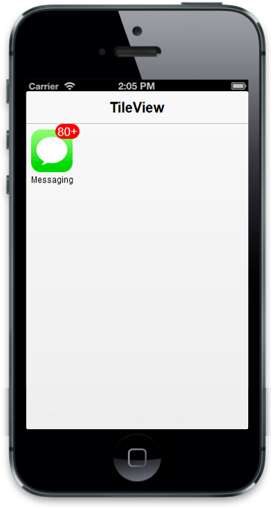

## Configure Badge

The badge property handles badge specific functionalities like enable or disable the badge and setting badge value for the Tile. The “data-ej-badge-text” property is used to set the text instead of number for Tile badge. The “data-ej-badge-maxvalue” and “data-ej-badge-minvalue” attribute are used to set the maximum and minimum badge value to a Tile respectively. 

Refer to the following code example.



    

        

        
 

    



The following screenshot illustrates the output of the above code.

{{ '' | markdownify }}
{:.image }

