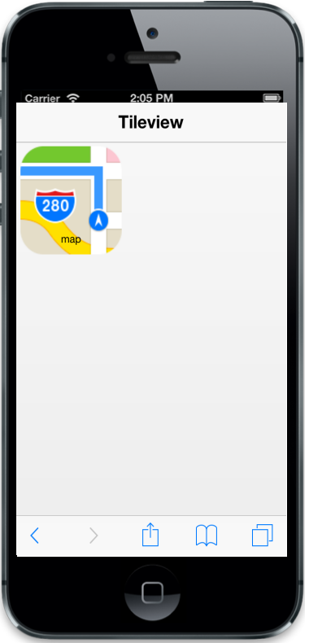

## Customize size

You can customize the size of the Tile by using the “data-ej-tilesize” attribute. The following built-in Tile sizes are supported.

* medium
* small
* large
* wide

Default value: small

Refer to the following code example.



 



The following screenshot illustrates the output of the above code.

{{ '' | markdownify }}
{:.image }

