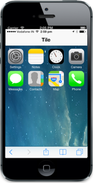
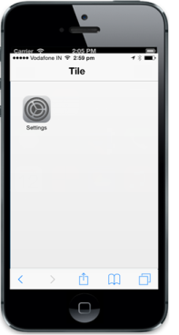

# Getting Started 

The following section guides you to add aTile control.

## Creating basic mobile layout

Create an HTML file and paste the following template for the mobile layout.



   <!DOCTYPE html>

<html>

<head>

    <meta id="viewport" name="viewport" content="width=device-width, initial-scale=1.0,maximum-scale=1.0, user-scalable=no" />

    <title>Tile</title>

    <link href="[http://cdn.syncfusion.com/13.1.0.21/js/mobile/ej.mobile.all.min.css](http://cdn.syncfusion.com/13.1.0.21/js/mobile/ej.mobile.all.min.css)" rel="stylesheet" />

    

    

    

    

</head>

<body>

    

        <!-- Adding Header Control Here -->

        <!-- Adding Tile Control here -->

    

</body>

</html>



## Add Header control for Tile

Refer to the following code example.



<div id="header" data-role="ejmheader" data-ej-title="Tile">
    



## Add a Tile control

Create a div element and set its data-role attribute as ejmtile. Each Tile image can be set by using data-ej-imageurl attribute. 

Refer to the following code example.



 

       

                    

 



Run the above code to render the following output. To know more details, refer to this [section](http://docs.syncfusion.com/js)

## Create Tile as grouped tile

In this scenario, you require different sizes of Tiles aligned in a grid-like manner. Here, you can add Tiles with the desired size to make the exact output. The Tile gets aligned automatically based on the size it gets rendered. You can define all the Tiles under the wrapper element with class named ‘group’ to make ‘n’ number of tiles as a grouped Tile.

Refer to the following code example.



<!-- Adding multiple tiles --> 

<div id="scrollcontent" class="defaultsample">

        <div class="group">

            <div class="column">

                <div id="tile1" data-role="ejmtile" data-ej-theme='dark' data-ej-imageurl='setting.png'

data-ej-imagepath="http://js.syncfusion.com/UG/Mobile/Content/tile" data-ej-text="Settings">

                

                <div class="small-col-2">

                <div id="tile2" data-role="ejmtile" data-ej-theme='dark' data-ej-imageurl='notes.png'

 data-ej-imagepath="http://js.syncfusion.com/UG/Mobile/Content/tile" data-ej-text="Notes">

                        

        <div id="tile3" data-role="ejmtile" data-ej-theme='dark' data-ej-imageurl='clock.png'

data-ej-imagepath="http://js.syncfusion.com/UG/Mobile/Content/tile" data-ej-text="Clock">

        

        <div id="tile4" data-role="ejmtile" data-ej-theme='dark' data-ej-imageurl='camera.png'

data-ej-imagepath="http://js.syncfusion.com/UG/Mobile/Content/tile" data-ej-text="Camera">

        

        <div id="tile5" data-role="ejmtile" data-ej-theme='dark' data-ej-imageurl='messaging.png'

data-ej-imagepath="http://js.syncfusion.com/UG/Mobile/Content/tile" data-ej-text="Messages">

        

        

       <div id="tile6" data-role="ejmtile" data-ej-theme='dark' data-ej-imageurl='contact.png'

data-ej-imagepath="http://js.syncfusion.com/UG/Mobile/Content/tile" data-ej-text="Contacts">

         

        <div id="tile7" data-role="ejmtile" data-ej-theme='dark' data-ej-imageurl='map.png'

data-ej-imagepath="http://js.syncfusion.com/UG/Mobile/Content/tile" data-ej-text="Map">

        

        <div id="tile8" data-role="ejmtile" data-ej-theme='dark' data-ej-imageurl='phone.png'

data-ej-imagepath="http://js.syncfusion.com/UG/Mobile/Content/tile" data-ej-text="Phone">

         

         

         

        



Add the following style to set the background image for the page.



  .e-m-ios7  .defaultsample

    {

    background: url(" http://js.syncfusion.com/UG/Mobile/Content/tile/bg.png")no-repeat scroll 0 0 / 100% 100% rgba(0, 0, 0, 0);

    height: 100%;

    width: 100%;

     position: absolute;

    }



Run the above code to render the following output. To know more details, refer to this [section](http://docs.syncfusion.com/js)

## Create a grouped tile in Windows Mode

In the windows mode scenario, you require different size of the live Tiles. To render the Grouped Tile in the windows mode and Tile with different size and as live Tiles, add the following code example.

Refer to the following code example.



if (ej.getRenderMode() == "windows" || ej.getRenderMode() == "flat") {

            $("#tile1").attr({ 'data-ej-tilesize': 'medium', 'data-ej-text':'People', 'data-ej-imageposition': 'fill' });

            $("#tile2").attr({ 'data-ej-backgroundcolor': ' rgb(208, 75, 43)' });

            $("#tile3").attr({ 'data-ej-livetile-updateinterval': '3500', 'data-ej-livetile-enabled': 'true', 'data-ej-livetile-type': 'flip', 'data-ej-livetile-imageurl': '["clock.png","messaging.png"]', 'data-ej-backgroundcolor': 'rgb(215, 147, 23)' });

            $("#tile4").attr({ 'data-ej-livetile-updateinterval': '3000', 'data-ej-livetile-enabled': 'true', 'data-ej-livetile-type': 'flip', 'data-ej-livetile-imageurl': '["notes.png","camera.png"]', 'data-ej-backgroundcolor': 'rgb(43, 128, 234)' });

            $("#tile5").attr({ 'data-ej-backgroundcolor': 'rgb(94, 58, 179)' });

            $("#tile6").attr({ 'data-ej-tilesize': 'medium', 'data-ej-text': 'Play','data-ej-backgroundcolor': 'rgb(145, 20, 154)' });

            $("#tile7").attr({ 'data-ej-tilesize': 'medium', 'data-ej-text': 'Map','data-ej-backgroundcolor': 'rgb(0, 157, 0)' });

            $("#tile8").attr({ 'data-ej-tilesize': 'wide', 'data-ej-text': 'Sports','data-ej-imageposition': 'fill' });

        }

        if (ej.getRenderMode() == "android") $('#scrollcontent').find('div[data-role="ejmtile"]').attr({ 'data-ej-theme': 'light' });

