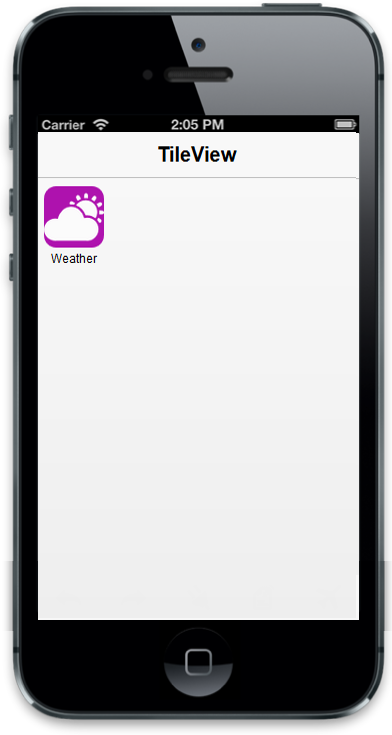
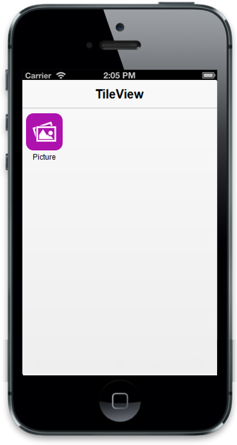

## Image Configuration

The “data-ej-imageposition” attribute is used to adjust the position of the Tile image. It accepts the following values.

1. center
2. top
3. bottom
4. right
5. left
6. topleft
7. bottomright
8. bottomleft 
9. fill

The “data-ej-backgroundcolor” attribute is used to set the background color of the Tile.

The “data-ej-imageurl” attribute is used to specify the file name for the background image of the Tile. The “data-ej-imagepath” attribute is used to define the root path that should contain the following folder structure to automatically render the background image based on the device/platform it gets rendered. All these three folder should contain the image files (with same name, but different images) that can be specified in the image url property.

* iOS7 - Folder name for ios7 specific images
* Android - Folder name for Android specific images
* Windows - Folder name for Windows specific images

_Note: Both data-ej-imagepath and data-ej-imageurl attribute can be set when you want to specify separate images for each render mode and so it is necessary to specify separate path for iOS, android and windows renderMode. When data-ej-imageurl attribute is alone used, you can provide common images for all render modes. So, you should provide the whole image path for this attribute._



 



The following screenshot displays the output of the above code.

{  | markdownify }
{:.image }

Also you can give images for each Tile through CSS classes by using the “data-ej-imageclass” attribute. You can define your desired styles in the specified class.

Refer to the following code example.



 



Refer to the following code example for CSS classes.



        .picture {

            background-image: url("../themes/sample/tileview/windows/calculator.png");

            background-color: #ae12ae;

            background-size: 40px 40px;

        }



The following screenshot illustrates the output of the above code.

{  | markdownify }
{:.image }

