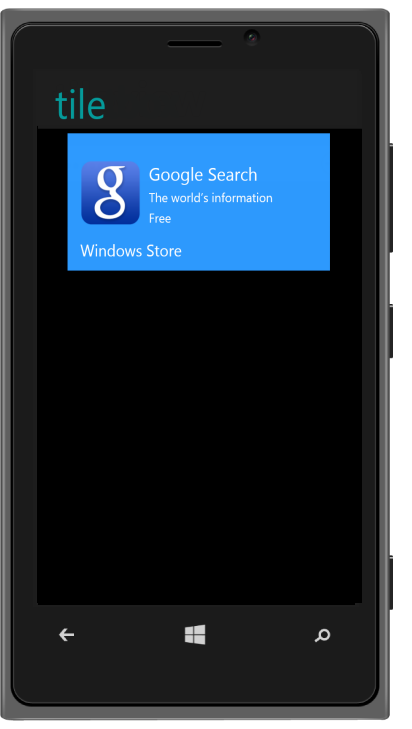

## Template Support

The “data-ej-imagetemplateid” and “data-ej-captiontemplateid” attributes are used to customize the image and caption/description of a Tile by providing the specific template id respectively. 

Refer to the following code example.



    

        

        

   

      

        

          Google Search 

          The world’s information 

          Free

        

       

    

    
Windows Store

    



The following screenshot illustrates the output of the above code.

{{ '' | markdownify }}
{:.image }

