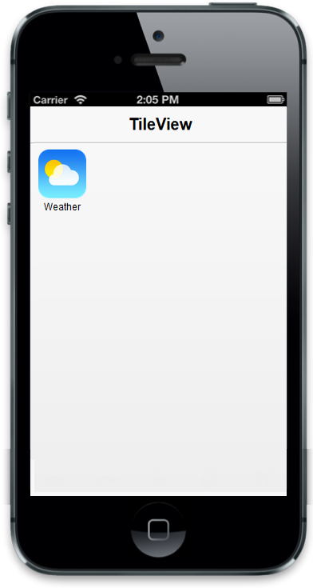

# Text Configuration

The “data-ej-showtext” attribute is used to show or hide the Tile caption. The text property is used to set the caption of a Tile. The “data-ej-textalignment” attribute is used to align the Tile text based on the requirement. The possible position values for textAlignment are as follows.

1. normal
2. left
3. right
4. center

The “data-ej-textposition” attribute wraps the text inside or outside of a Tile. The possible position values of “data-ej-textposition” are inner and outer.

N> TextPosition support is given only to iOS7 and android mode. TextPosition is not supported in small Tiles.



    

        

        
 

    



The following screenshot illustrates the output of the above code.

