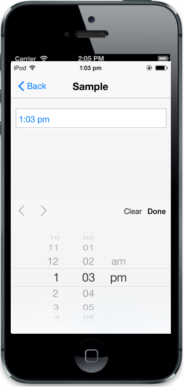

## Native TimePicker

The data-ej-renderdefault attribute is used to enable iOS7 native TimePicker instead of the Syncfusion’s TimePicker. By using iOS7 native TimePicker, you cannot customize theme, etc. The default value is false.



<input id="timepicker" data-role="ejmtimepicker" data-ej-rendermode="ios7" data-ej-ios7-renderdefault=true data-ej-hourformat="twelve" />



The following screenshot displays the output.

{  | markdownify }
{:.image }

