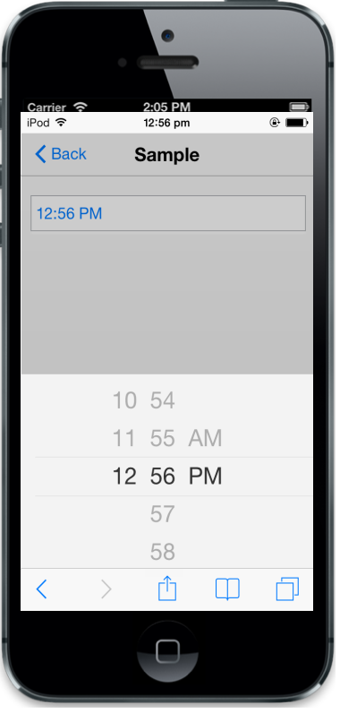

## Time Settings

The data-ej-value attribute is used to set the initial time for the TimePicker. The default value is set to the current system time. The data-ej-hourformat attribute allows you to set twelve or twenty four-hour format. The time format can be customized by using the data-ej-timeformat attribute.



<input id="timepicker" data-role="ejmtimepicker" data-ej-hourformat="twelve" data-ej-value="12:56 PM" data-ej-timeFormat="hh:mm tt"/>



The following screenshot displays the output.

{{ '' | markdownify }}
{:.image }

