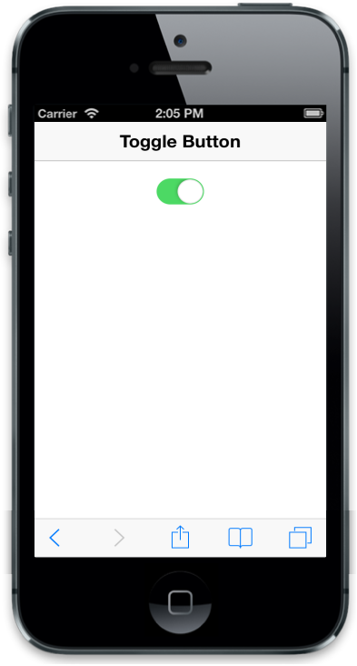

## Animate

data-ej-animate attribute specifies the transition effect for state change. When you set this attribute to false, no animation occurs when changing the state of Toggle Button (ON/OFF). Default value is true. You can refer to the following code example.



    

    



The following screenshot displays the Animate Toggle Button:

{{ '' | markdownify }}
{:.image }

