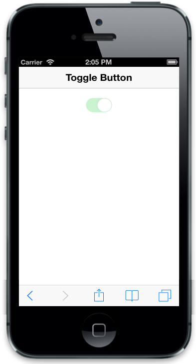

## Enable

data-ej-enabled attribute specifies whether to Enable or Disable the control. When you set this attribute to false, the control renders in disabled mode. Default value is set to true.



    

   



The following screenshot displays the Enable Toggle Button:

{  | markdownify }
{:.image }

