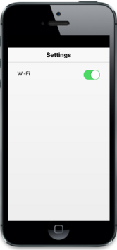
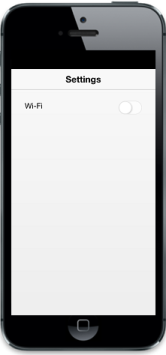
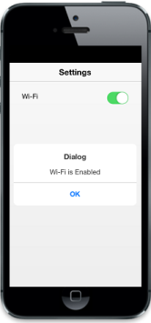
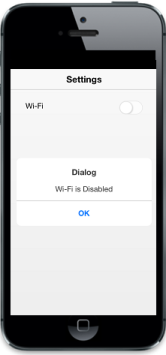

# Getting Started

Essential Toggle button is used in JS Mobile Widget functions, to switch On/Off functions such as Bluetooth, Airplane Mode, and WiFi. 

{{ '' | markdownify }}
{:.image }

## Create the Layout

The following steps help you to add a Toggle button in the “Settings” menu of a mobile and use it to enable or disable a Wi-Fi connection.

Create an HTML file and add the following template to the HTML file. 



 <!DOCTYPE html>

<html>

<head>

    <meta id="viewport" name="viewport" content="width=device-width, initial-scale=1.0,maximum-scale=1.0, user-scalable=no" />

    <title>Toggle button</title>

    <link href="[http://cdn.syncfusion.com/13.1.0.21/js/mobile/ej.mobile.all.min.css](http://cdn.syncfusion.com/13.1.0.21/js/mobile/ej.mobile.all.min.css)" rel="stylesheet" />

                    

 

<scriptsrc="[http://cdn.syncfusion.com/js/assets/external/jquery.globalize.min.js](http://cdn.syncfusion.com/js/assets/external/jquery.globalize.js)"></script>

    

</head>

<body>

    <div data-role="appview">

        <!-- Header control -->

        <div id="header"  data-ej-title="Settings" data-ej-position="normal" 
             data-role="ejmheader">

        <div id="content">

        

        <div id="form" style="margin: 25px 30px;">

        Wi-Fi 

        <!-- Add toggle button -->

        

        <!-- Dialog control -->

        <div id="alertdlg" data-role="ejmdialog" data-ej-title="Dialog" `

        data-ej-leftbuttoncaption="OK" data-ej-buttontap="alertClose">

        <div id="dialogContent">

        

        

        

        <!-- Scroll panel control -->

        <div data-role="ejmscrollpanel" data-ej-target="content">

    

</body>

</html>



## Add Toggle Button

To add a Toggle button, set data-role attribute to ejmtogglebutton for a 
 element. Initially, Mobile Toggle button control is rendered with the default values of all properties and you can customize Mobile Toggle button control by changing its properties according to your requirement.  

Add the following code example to the 
 element.



    



Run the code and get the following output.

{{ '' | markdownify }}
{:.image }

## Change Toggle button to render state

You can customize the initial Toggle button rendering state by data-ej-togglestate attribute that accepts a Boolean value as input. In this scenario, set the value to “False”.

Add the following code to the toggle 
.





Run this code to get the following output.

{{ '' | markdownify }}
{:.image }

## Handle events

In this scenario, when the Toggle button state is changed, a Dialog appears saying “Wi-Fi state is enabled,” or, “disabled”. This is achieved by data-ej-change event. Whenever the Toggle button’s state is changed, the change event is raised. This event can be handled by appropriate functions.

Add the code example to the Toggle 
.



    



Add the following script code to the <body> tag to show the Dialog when you change the Toggle state.



        $(function (args) {

            window.dialogObject = $("#alertdlg").data("ejmDialog"); //To create Dialog object

        });

        //Opens Dialog

        function showDialog(args) {

            (args.state) ? $("#dialogContent").html("Wifi is Enabled") : $("#dialogContent").html("Wifi is Disabled"); //Adds content to the Dialog 

            dialogObject.open(); //Open Dialog

        }

        //Closes Dialog

        function alertClose(args) {

            dialogObject.close(); //Closes Dialog

        }



Run this code to get the following output. 

{{ '' | markdownify }}
{:.image }

{{ '' | markdownify }}
{:.image }

