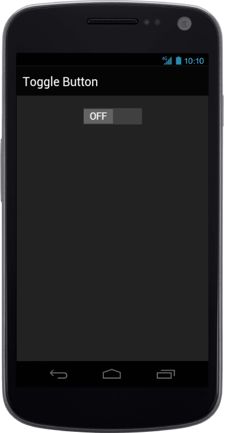

## ToggleState

data-ej-togglestate attribute is used to set the state of the Toggle Button in which the control should render initially. When this attribute set to false, the control renders with OFF state, otherwise it will render with ON state. By default, the control renders with ON state.



    

    



The following screenshot displays the ToggleState:

{  | markdownify }
{:.image }

