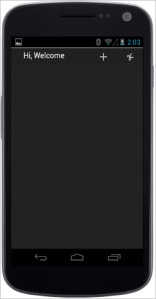
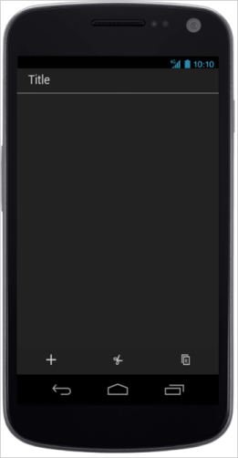
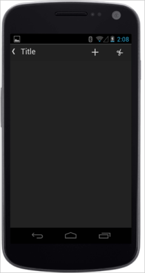
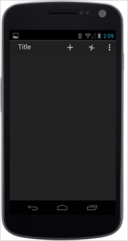
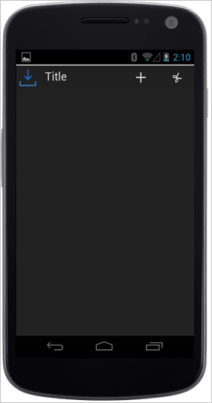

## Android specific customization

You can set the Android specific properties to the control by means of accessing Android property.

### Templating

You can customize the Toolbar left side content by using templating feature. This is achieved by setting data-ej-templateid attribute that specifies the id of the template element.

Refer to the following code example.



    

        <ul>

            <li data-ej-iconname="add"></li>

            <li data-ej-iconname="cut"></li>

        </ul>

    

    Hi, Welcome 



The following screenshot illustrates the output of the above code.

{  | markdownify }
{:.image }

### EnableSplitView

The data-ej-enablesplitview attribute separates the title and the toolbar items that is displayed at the bottom of the page. You can change the title text by setting the desired title for data-ej-title attribute

Refer to the following code example.



  

            <ul>

                <li  data-ej-iconname="add" ></li>

                <li data-ej-iconname="cut" ></li>

                <li data-ej-iconname="copy" ></li>

                <li data-ej-iconname="save" ></li>

                <li data-ej-iconname="search" ></li>

            </ul>

    



The following screenshot illustrates the output of the above code.

{  | markdownify }
{:.image }

### ShowBackNavigator

When you use Android type toolbar, it can be displayed with navigator icon that is used for navigating to the previous page. To enable this, you can use data-ej-showbacknavigator attrubute.

Refer to the following code example.



            <ul>

                <li  data-ej-iconname="add"></li>

                <li data-ej-iconname="cut"></li>

                <li data-ej-iconname="copy"></li>

                <li data-ej-iconname="save"></li>

                <li data-ej-iconname="search"></li>

            </ul>

        



The following screenshot illustrates the output of the above code.

{  | markdownify }
{:.image }

### ShowEllipsis

When the number of items is more, the toolbar can’t display all the items. Since it doesn’t fit the device width. Therefore, the over flowed items can be displayed as a menu when you click the ellipsis present in the Toolbar. To display the ellipsis, enable the data-ej-showellipsis attribute. 

Refer to the following code example.



            <ul>

                <li  data-ej-iconname="add"></li>

                <li data-ej-iconname="cut"></li>

                <li data-ej-iconname="copy"></li>

                <li data-ej-iconname="save"></li>

                <li data-ej-iconname="search"></li>

            </ul>

 



The following screenshot illustrates the output of the above code.

{  | markdownify }
{:.image }

### ShowTitleIcon

The android Toolbar can be displayed with a logo or icon specific to the application. The data-ej-showtitleicon is used to display the title logo or icon when it is set to true. The data-ej-titleiconurl is used to provide the URL of the icon or logo that is displayed near the Toolbar title. 

Refer to the following code example.



            <ul>

                <li  data-ej-iconname="add"></li>

                <li data-ej-iconname="cut"></li>

                <li data-ej-iconname="copy"></li>

                <li data-ej-iconname="save"></li>

                <li data-ej-iconname="search"></li>

            </ul>

        



The following screenshot illustrates the output of the above code.

{  | markdownify }
{:.image }

