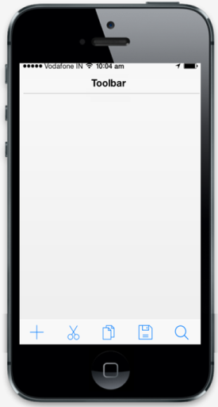
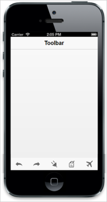

## Configure icons

You can use different icons in your Toolbar and also you can customize these icons for each item by using the data-ej-iconname attribute.

The following built-in icons can be used in Toolbar.

* Add
* Back
* Bookmark
* Close
* Compose
* Copy
* Cut
* Delete
* Done
* Edit
* Mail
* Next
* Refresh
* Overflow
* Paste
* Reply
* Save
* Search
* Settings
* Share

Refer to the following code example.



   

            <ul>

                <li data-ej-iconname="add" li>

                <li data-ej-iconname="cut"></li>

                <li data-ej-iconname="copy"></li>

                <li data-ej-iconname="save"></li>

                <li data-ej-iconname="search"></li>

            </ul>

     



The following screenshot illustrates the output of the above code.

{  | markdownify }
{:.image }

You can set the user defined icons using data-ej-iconurl attribute. This property overrides the data-ej-iconname attribute when both properties are set at a time. 



            <ul>

                <li data-ej-iconurl=" http://js.syncfusion.com/UG/Mobile/Content/toolbar/back.png"></li>

                <li data-ej-iconurl=" http://js.syncfusion.com/UG/Mobile/Content/toolbar/forward.png"></li>

                <li data-ej-iconurl=" http://js.syncfusion.com/UG/Mobile/Content/toolbar/plugin.png"></li>

                <li data-ej-iconurl=" http://js.syncfusion.com/UG/Mobile/Content/toolbar/edit.png"></li>

                <li data-ej-iconurl=" http://js.syncfusion.com/UG/Mobile/Content/toolbar/airoplane_mode.png"></li>

            </ul>

        



The following screenshot illustrates the output of the above code.

{  | markdownify }
{:.image }

