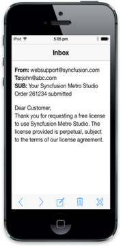
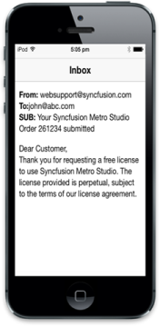
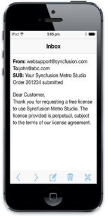
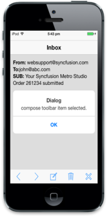

# Getting Started

## Create your first Rotator in JavaScript

The Essential JavaScript mobile toolbar provides a single interface to select a command from a collection of commands. It also provides template support. In this example, you can learn how to create a Mail App and through that you can learn the features of Mobile Toolbar Widget.

## Create the necessary layout

The Essential JavaScript Mobile Toolbar Widget is created by using number of <ul> and <li>. Each <li> item performs individual actions. You can customize the Toolbar control by changing its properties according to your requirement. In this scenario, a _back_ toolbar item is used to navigate to previous page, _next_ toolbar item to show the next email in the inbox, _compose_ toolbar item to compose new mail, delete toolbar item to delete current mail, and close toolbar item to close the inbox app. The following steps guide you in creating a basic Toolbar for your application.

Create an HTML file and add the following template to the html file for Toolbar creation.



<!DOCTYPE html>

<html>

<head>

    <title>Toolbar</title>

    <link href="[http://cdn.syncfusion.com/13.1.0.21/js/mobile/ej.mobile.all.min.css](http://cdn.syncfusion.com/13.1.0.21/js/mobile/ej.mobile.all.min.css)" rel="stylesheet" />

    

    

    

    

    

</head>

<body>

    

        

        <!--Add Toolbar Elements here. -->

        

            

                <!--Adding Inbox sample content-->

                

                    From: websupport@syncfusion.com 

                    To:john@abc.com 

                    SUB: Your Syncfusion Metro Studio Order 261234 submitted 

                     

                    

                        Dear Customer, 

                        Thank you for requesting a free license to use Syncfusion Metro Studio. The license provided is perpetual, subject to the terms of our license agreement.

                    

                

                <!—Adding dialog control -->

                

                    

                    

                

            

        

        

    

</body>

</html>



Execute this code to render the following output.

## Create Toolbar Control

To render the Toolbar control, set data-role attribute to ejmtoolbar in a 
 element and include a list of Toolbar items to be added. There are 20 built-in icons for Toolbar items. This can be achieved by using the data-ej-iconname attribute.  



 <!--Adding toolbar control-->

<div id="toolbar" data-role="ejmtoolbar" data-ej-position="normal"  data-ej-windows-position="fixed" data-ej-android-position="fixed" data-ej-android-title="Inbox">

<ul>

<li data-ej-iconname="back"></li>

<li data-ej-iconname="next"></li>

<li data-ej-iconname="compose"></li>

<li data-ej-iconname="delete"></li>

<li data-ej-iconname="close"></li>

</ul>



Use the following styles for content style.



           .e-m-header.e-m-android {

               display: none;

           }



Run this code to render the following output.

## Add functionalities for toolbar items 

You can provide functionalities for each Toolbar items and this can be achieved by adding data-ej-touchend attribute. When you click the Toolbar item, its corresponding touchend event triggers, and is handled using the performAction function as shown in the following code example. 



<!--Adds toolbar control-->

<div id="toolbar" data-role="ejmtoolbar" data-ej-touchend="performAction" data-ej-position="normal" data-ej-android-position="fixed" data-ej-android-title="Inbox" data-ej-windows-position="fixed" >

<ul>

<li data-ej-iconname="back"></li>

<li data-ej-iconname="next"></li>

<li data-ej-iconname="compose"></li>

<li data-ej-iconname="delete"></li>

<li data-ej-iconname="close"></li>

</ul>





$(document).ready(function (args) {

window.dialogObject = $("#alertdlg").data("ejmDialog"); //creates object for dialog

});

// toolbar touch end event

function performAction(args) {

var itemName = args.itemname;// to get the toolbar item name

$("#dialogContent").append(itemName + " toolbar item selected."); // appends the content to the dialog

window.dialogObject.open();//Shows dialog

}

//closes dialog

function alertClose(args) {

$("#dialogContent").empty(); //empties dialog content

window.dialogObject.close(); //closes dialog

}



Execute this code to render the following output. 

