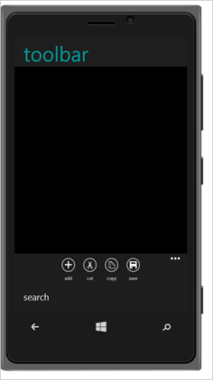

# Windows phone specific toolbar

In windows phone mode, when the number of toolbar items is more than 4, then the remaining items is rendered inside a menu container. And an overflow icon is added with toolbar to display the menu container.
Refer to the following code example.



        

            <ul>

                <li data-ej-iconname="add"></li>

                <li data-ej-iconname="cut"></li>

                <li data-ej-iconname="copy"></li>

                <li data-ej-iconname="save"></li>

                <li data-ej-iconname="search"></li>

            </ul>

        



The following screenshot illustrates the output of the above code.

